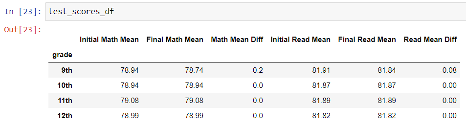
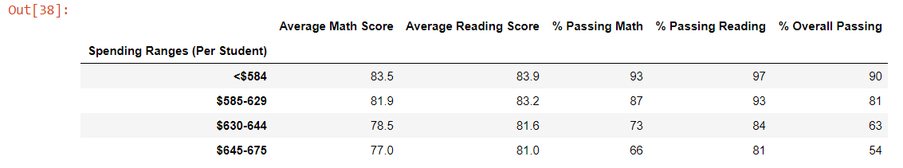

# School-Analysis

## Overview of Project
The school board reached out to our analysis firm to review school district test scores by various dimensions, such as size of school, budget per student, and school type. In order to analyze this data, we are making use of Jupyter Notebooks and the Python package named Pandas.

After reviewing the district test scores for Maria and the school board, we discovered that the 9th grade math and reading test scores from Thomas High School appear to have been altered. As a result, we need to go back through the data and replace the Thomas High School ninth grade test scores with NaN values. After we remove those values, we need to redo our district analysis without the Thomas High School ninth grade scores. 

While the project syllabus calls for the use of bulleted lists and images throughout the analysis report, our analysts believe that embedding tables within the GitHub markup provides the most detailed and useful reference for the client. 

## Results
### How is the district summary affected?
The District Summary included the following fields (columns):*'Total Schools', 'Total Students', 'Total Budget', 'Average Math Score','Average Reading Score', '% Passing Math', '% Passing Reading','% Overall Passing'.* Of these fields, all of the values specific to student scores changed after we removed the ninth grade test scores from Thomas High School. Specifically, the values changed from these initial values to these modified values:
| Field Name | Initial Value  | Modified Value |
| --- | --- |--- |
|**Average Math Score** | 79% |78.9%|
|**Average Reading Score**| 81.9% | 81.9% |
|**% Passing Math**| 75% | 74.8% |
|**% Passing Reading**| 85.8% |85.7%|
|**% Overall Passing**| 65.2% |64.9%|

### How is the school summary affected?
After removing the Thomas High School ninth grade scores, the overall scores for Thomas High School decreased slightly across all fields from the Initial analysis to the Final analysis. During analysis, there was an interim School Summary table with significantly lower values. This was caused by erroneously dividing the variables *per_student_passing_math, per_student_passing_reading, and per_passing_math_reading* by a count of the entire student body of Thomas High School (1635) rather than a count of 10th-12th graders (1174).
| Field Name | Initial Value  | Interim Value | Final Value |
| --- | --- | --- | --- |
|**Average Math Score** | 83.42% | 83.35% |83.35%|
|**Average Reading Score**| 83.85% | 83.9% | 83.9% |
|**% Passing Math**| 93.27% | 66.91% |93.19% |
|**% Passing Reading**| 97.31% | 69.66% |97.02%|
|**% Overall Passing**| 90.95% | 65.08% |90.63%|

### How does replacing the ninth graders’ math and reading scores affect Thomas High School’s performance relative to the other schools?
As the previous table showed, the overall passing percentage dropped from an initial value of 90.95% to a final value of 90.63%. This reduction of .32% did not change the overall rank of Thomas High School compared to the other High Schools in the district, remaining in second place.
| Top Five Schools | Initial Rank | Final Rank | % Overall Passing |
| --- | --- | --- | --- |
|**Cabrera High School** | 1 | 1 |91.33%|
|**Thomas High School**| 2 | 2 | 90.63% |
|**Griffin High School**| 3 | 3 |90.6% |
|**Wilson High School**| 4 | 4 |90.58%|
|**Pena High School**| 5 | 5 |90.54%|

### How does replacing the ninth-grade scores affect the following:
#### Math and reading scores by grade
Only the Ninth Grade math and reading scores were changed by the data cleaning process. The test scores for tenth, elevent, and twelfth grade remain unchanged. Instead of a number value the ninth grade test score returns a value of NaN - which is a NumPy value that signifies "Not a Number."
| Thomas High School | Initial Math Value  | Final Math Value | Initial Reading Value  | Final Reading Value | 
| ---    | ---    | ---    | ---  |--- |
|**Ninth Grade** | 83.59% | NaN |83.73%| NaN |
|**Tenth Grade**| 83.09% | 83.09% | 84.25% |84.25%|
|**Eleventh Grade**| 83.5% | 83.5% |83.59%| 83.59%|
|**Twelfth Grade**| 83.5% | 83.5% |83.83%|83.83%|

If we compare student grades across all district schools, we see that the district average of Ninth Grade reading and math both drop by removing the Thomas High School scores. These values both drop because the Thomas High School test scores are higher than the mean, by removing these values we lower the mean. The math mean lowers by .2% and the reading mean lowers by .08%.
| District-Wide | Initial Math Value  | Final Math Value | Initial Reading Value  | Final Reading Value | 
| ---    | ---    | ---    | ---  |--- |
|**Ninth Grade** | 78.94% | 78.74% |81.91%| 81.84% |
|**Tenth Grade**| 78.94% | 78.94% | 81.87% |81.87%|
|**Eleventh Grade**| 79.08% | 79.08% |81.89%| 81.89%|
|**Twelfth Grade**| 78.99% | 78.99% |81.82%|81.82%|

#### Scores by school spending
When organizing by school spending per student, Thomas High School falls within the bin labeled "$630-644." Since our revised analysis only changes Thomas High School, the other bins remain unchanged. For the impacted bin, the values changed accordingly:
| Field Name | Initial Value  | Modified Value | Change |
| --- | --- |--- |--- |
|**Average Math Score** | 78.52% |78.5%| Decrease of .02% |
|**Average Reading Score**| 81.62% | 81.64% | Increase of .02% |
|**% Passing Math**| 73.48% | 73.46% | Decrease of .02% |
|**% Passing Reading**| 84.39% |84.32%| Decrease of .07%|
|**% Overall Passing**| 62.86% |62.78%| Decrease of .08%|

#### Scores by school size
While organizing by school size, Thomas High School falls within the "Medium" category, with a student population between 1000-2000 students. Since our revised analysis only changes Thomas High School, the other size categories remain unchanged. For the impacted category, the values changed accordingly:
| Field Name | Initial Value  | Modified Value | Change |
| --- | --- |--- |--- |
|**Average Math Score** | 83.37% |83.36%| Decrease of .01% |
|**Average Reading Score**| 83.86% | 83.87% | Increase of .01% |
|**% Passing Math**| 93.6% | 93.58% | Decrease of .02% |
|**% Passing Reading**| 96.79% |96.73%| Decrease of .03%|
|**% Overall Passing**| 90.62% |90.57% | Decrease of .05%|

#### Scores by school type
While organizing by school type, Thomas High School is a Charter school. Since our revised analysis only changes Thomas High School, the other size school type categories remain unchanged. For Charter schools however, the values changed very slightly. In order to show changes, we have rounded to the thousandths place in the following table:
| Field Name | Initial Value  | Modified Value | Change |
| --- | --- |--- |--- |
|**Average Math Score** | 83.473% |83.465%| Decrease of .008% |
|**Average Reading Score**| 83.896% | 83.902% | Increase of .006% |
|**% Passing Math**| 93.621% | 93.610% | Decrease of .011% |
|**% Passing Reading**| 96.586% |96.550%| Decrease of .036%|
|**% Overall Passing**| 90.432% |90.392% | Decrease of .040%|

## Summary
In final summation, removing the Ninth Grade test scores from Thomas High School did not have a significant impact to the analysis report. Removing the Thomas High School scores did not impact most dimensions in excess of .1%. The four most significant changes (>.2%) are as follows:
* School District Summary 
  * **Overall Passing %** This value was reduced from 65.2% to 64.9%, at a total reduction of .3%
* District-wide Scores by Grade Level 
  * **Ninth Grade Math Score** This value was reduced from 78.94% to 78.74%, at a total reduction of .2%
* Thomas High School
  * **Average Reading Score** This value was reduced from 97.31%	to 97.02% for a .29% reduction
  * **Overall Passing %** This value was reduced from 90.95% to 90.63%, for a reduction of .32%

The interim scores should not be considered as a significant value for the sake of comparison. These values do not accurately represent scores at Thomas High School, but were erroneous calculations resulting from removing the Ninth Grade test scores and not changing the function by which we were calculating the mean.

The school board should not worry about whether removing the Thomas High School values has a significant impact on grade averages. By almost all dimensions, the impact was minimal. This analysis should still provide great value for identifying best practices and areas of concern along a number of dimensions. Of particular interest is the fact that there is a negative coorelation between the amount spent on each student and the outcomes. This is a counter-intuitive finding and should be investigated further.

